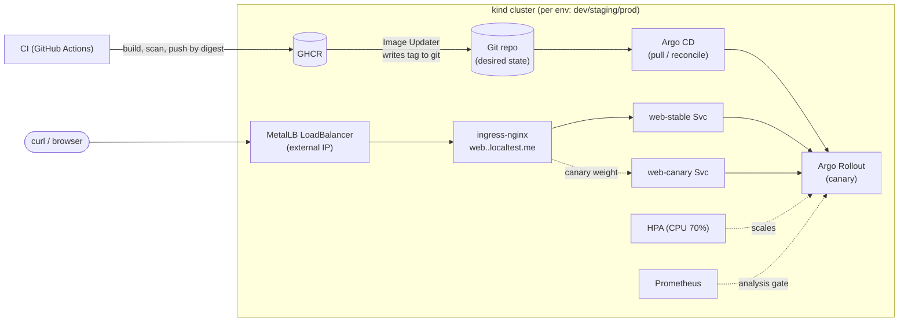

# Senior DevOps Assignment — Containerized Web App on Kubernetes

A production-oriented, reproducible deployment of a small containerized web app,
with Infrastructure as Code, a CI/CD pipeline, and a documented security,
observability, and scaling story.

The goal here is to show **engineering decisions and reasoning**, not a pile of
tools. Everything runs locally on `kind` so a reviewer can reproduce it end-to-end
with **no cloud account and no cost**, while the patterns (reusable IaC modules,
base/overlay config, digest-based promotion) are exactly the ones I'd use on a
managed cloud cluster.

---

## TL;DR — reproduce it

**Prereqs:** `docker`, `kind`, `kubectl`, `terraform` (≥ 1.5). *(macOS: `brew install kind kubectl terraform` + Docker Desktop.)*

```bash
make all ENV=dev      # provision kind cluster + addons, build image, deploy, smoke-test
# then:
curl -H "Host: web.dev.localtest.me" http://localhost/     # {"env":"dev","pod":"dev-web-...",...}
make down ENV=dev     # tear the cluster down
```

`make all` runs: `terraform apply` (cluster + ingress-nginx + metrics-server) →
`docker build` → `kind load` → `kubectl apply -k` → `rollout status` → `curl`.
Individual steps: `make up | build | load | deploy | smoke`.

---

## Repository layout

```
app/                     Flask app (/, /healthz, /readyz, /metrics, /work) + Dockerfile + tests
infra/
  modules/kind-cluster/  Reusable: a kind cluster wired for ingress   <-- reusable infra
  modules/addons/        Reusable: ingress-nginx + metrics-server (Helm)
  environments/          dev/ staging/ prod/ — thin wiring + tfvars     <-- env-specific config
deploy/
  base/                  Env-agnostic manifests: Rollout (canary), Services, HPA,
                         default-deny NetworkPolicies...
  overlays/{dev,staging,prod}/  Per-env name/scale/config/image
argocd/                  GitOps CD: AppProject + per-env Applications (app-of-apps)
.github/workflows/       ci.yaml — build/test/scan/push only (CD is Argo, not CI)
.github/CODEOWNERS + pull_request_template.md   PR governance
docs/architecture.md     Production architecture (30 microservices) + diagram
docs/troubleshooting.md  The latency-incident playbook
docs/governance.md       Branch protection & PR/rebase workflow
Makefile                 One-command local workflows
```

## Architecture (this repo)



- **Delivery:** CI only builds/scans/pushes; **Argo CD pulls** desired state from
  git and reconciles it (no external system holds cluster creds). **Argo Rollouts**
  does a **canary** (20 % → analysis → 50 % → 100 %), auto-aborting if the
  Prometheus success-rate gate fails.
- **External exposure:** **MetalLB** gives ingress-nginx a real `LoadBalancer`
  external IP (not a NodePort/hostPort hack) → Ingress → `web-stable` Service →
  pods. During a canary, nginx splits traffic to `web-canary` by weight.
- **Health checks:** separate **liveness** (`/healthz`, cheap, dependency-free),
  **readiness** (`/readyz`, gates traffic), and **startup** probes.
- **Networking:** Cilium is the CNI (kind's default doesn't enforce policy),
  with explicit pod/service subnets; namespaces are **default-deny** with explicit
  allows only. MetalLB provides real LoadBalancer IPs.
- **Availability & scalability:** `minReplicas ≥ 2` (prod 3), HPA on CPU,
  PodDisruptionBudget, topology spread across nodes.

For the **30-microservice production design** (mesh, managed Postgres/Redis/
RabbitMQ, GitOps, multi-team, 99.9 %), see **[docs/architecture.md](docs/architecture.md)**.

## Deployment process

**Local (this repo):** `make all ENV=<env>` — see TL;DR.

**CI (`.github/workflows/ci.yaml`)** — the *only* part in GitHub Actions. On every
push/PR: unit tests → build all Kustomize overlays → build image → **Trivy** scan
→ push to GHCR tagged with the **immutable git SHA**. CI holds no cluster creds.

**CD is GitOps (`argocd/`)** — Argo CD runs *in* the cluster and continuously
reconciles each env to what git declares. This inverts the trust model: nothing
outside the cluster can deploy; the cluster pulls. Git is the source of truth and
the audit log.

### Artifact promotion
One artifact, built once, identified by **immutable digest** — never rebuilt per
env. Promotion = moving that tag through git:
1. **dev:** Argo CD **Image Updater** sees the new image and writes the tag to
   `deploy/overlays/dev` in git; Argo auto-syncs dev.
2. **staging → prod:** a PR bumps the tag in the env overlay (or `argocd app
   sync`). The staging/prod Applications have **no automated sync**, so promotion
   is a deliberate, reviewed step.
Because it's the same digest, "passed in staging" means the identical bits ship.

### Progressive delivery & rollback
- **Canary:** the `Rollout` shifts traffic 20 % → (Prometheus analysis) → 50 % →
  100 %. If the success-rate gate fails, Argo Rollouts **auto-aborts** and traffic
  stays on the stable version — a bad release never reaches 100 %.
- **Rollback, fast:** `kubectl argo rollouts undo web -n web-prod` (or `abort`) —
  seconds, no rebuild.
- **Rollback, source-of-truth:** revert the git commit; Argo reconciles the
  cluster back. The rollback is itself an auditable PR.

## Security decisions

**No secrets in Git.** There are none in this repo (`ConfigMap` holds only
non-secret config). CI auth uses the short-lived, auto-injected `GITHUB_TOKEN`
and **OIDC** (`id-token: write`) — no long-lived cloud keys or kubeconfigs are
stored as secrets. In production, app secrets come from a cloud secrets manager
via the **External Secrets Operator**, and workloads authenticate with
**workload identity** (IRSA / GKE Workload Identity), never static credentials.

**Least privilege, applied here:**
- Dedicated `ServiceAccount` per workload, bound to **no** Roles, with
  `automountServiceAccountToken: false` (the app never calls the K8s API).
- Container: `runAsNonRoot`, `readOnlyRootFilesystem`, `allowPrivilegeEscalation:
  false`, **all capabilities dropped**, `seccompProfile: RuntimeDefault`.
- Non-root image (dedicated user in the Dockerfile), minimal `slim` base,
  multi-stage build to keep the attack surface small; Trivy scans in CI.

**Three (＋) security risks I considered:**
1. **Leaked credentials / secret sprawl.** *Mitigation:* nothing sensitive in Git
   or images; OIDC + short-lived tokens in CI; External Secrets + workload
   identity in prod; `.gitignore` excludes state/kubeconfigs.
2. **Compromised or vulnerable container image (supply chain).** *Mitigation:*
   pinned base image, multi-stage minimal image, non-root, Trivy scan in CI
   (gate on CRITICAL in prod), deploy by **immutable digest**; next step is image
   signing (cosign) + admission policy to only run signed images.
3. **Over-privileged workload / lateral movement.** *Mitigation:* least-privilege
   SA with no API token, dropped caps + read-only FS limit what a compromised pod
   can do; **default-deny NetworkPolicies** (enforced by the Cilium CNI — kind's
   default CNI ignores them) contain east-west movement: pods get DNS egress only,
   and web accepts ingress only from the ingress controller and Prometheus. In
   prod, add mesh mTLS and namespace RBAC/quotas for multi-team isolation.
4. *(bonus)* **Sensitive data exposure** — encryption in transit (mTLS) and at
   rest (KMS on datastores), least-privilege DB users per service.

## Observability & troubleshooting

- **Metrics:** app exposes Prometheus metrics at `/metrics` (request rate,
  latency histogram, errors — the RED method) with scrape annotations; cluster
  metrics via metrics-server (and Prometheus/Grafana in prod).
- **Health:** liveness/readiness/startup probes as above.
- **Alerting (prod):** SLO **burn-rate** alerts on latency/error budget, not just
  CPU — see below why that matters.

**Latency incident playbook** (all pods green, CPU 35 %, mem 55 %, no deploy, but
latency 200 ms → 5 s): full order-of-investigation, commands, hypotheses,
mitigation, and follow-up in **[docs/troubleshooting.md](docs/troubleshooting.md)**.
Short version: low CPU + healthy pods + a round-number 5 s ⇒ the app is **blocked
off-CPU on a downstream dependency** (most likely DB slowdown → connection-pool
exhaustion → queueing). A CPU-only HPA would never react to this — which is why
prod alerts/autoscaling should key off latency/queue depth too.

## Assumptions
- A reviewer has Docker + kind locally; cloud accounts aren't assumed (by design).
- "Any simple app" — I wrote a tiny Flask app so the CI build/test is *real*
  rather than pulling a stock image, and so probes/metrics are meaningful.
- Single region, multi-AZ is sufficient for the 99.9 % target; multi-region DR is
  out of scope.
- Terraform state is local by default so `init` works with no cloud account; each
  env ships a `backend.tf.example` (S3 + native state locking) to switch on.
- `main` is governed by branch protection (PR-only, review, rebase/linear history);
  see `docs/governance.md`.

## Trade-offs
- **kind over a real cloud:** maximal reproducibility/zero cost for a reviewer, at
  the price of not exercising real cloud IAM/LB/managed data. The module boundary
  (`infra/modules/kind-cluster`) is where you'd swap in an EKS/AKS/GKE module
  without touching envs, app, or CD.
- **GitOps (Argo) over push-based CI deploys:** CI never holds cluster creds; the
  cluster pulls from git. More moving parts (Argo CD/Rollouts controllers) but the
  correct model past a single service — and the promotion/rollback story is git.
- **Kustomize over Helm:** base/overlays make the "reusable vs env-specific" split
  explicit with no templating; Helm is better for packaging *many* services (30).
- **No CPU limit, memory limit set:** avoids CPU throttling latency; caps the
  non-compressible resource. Deliberate — explained inline in `rollout.yaml`.
- **Canary analysis needs Prometheus:** installed as an addon; the AnalysisTemplate
  queries the app's own `app_requests_total` for success rate.

## What I'd improve with more time
- Run Argo end-to-end on the local cluster (bootstrap script applies `argocd/`)
  and demo a canary auto-abort; wire Argo notifications to Slack.
- Image signing (cosign) + admission control (Kyverno/Gatekeeper) to only run
  signed, non-root, resource-bounded workloads.
- Full observability stack (kube-prometheus-stack + Grafana + OTel tracing) and
  SLO burn-rate alerts as Terraform-managed addons.
- Secrets via External Secrets Operator; Cilium L7 policies + Hubble dashboards.
- `terraform plan` + policy checks (tfsec/Checkov/OPA) as required PR status checks.

## Validation (run live, not just linted)
The full stack was brought up end-to-end on a real kind cluster via `terraform
apply` and verified:
- `terraform apply` provisions the cluster + Cilium + MetalLB + ingress-nginx +
  Argo CD + Argo Rollouts + Prometheus + metrics-server cleanly.
- Nodes reach **Ready** (proves the Cilium-first ordering), MetalLB assigns a real
  **LoadBalancer external IP**, and `curl` through `LB IP → ingress → web-stable →
  pod` returns the app response.
- **NetworkPolicy is enforced**: a pod in `default` is denied; a pod in the
  allowed `monitoring` namespace succeeds.
- App runs as a healthy Argo `Rollout` behind the HPA.

Running it surfaced (and I fixed) several bugs static checks miss: Kustomize not
rewriting name-references inside the Rollout CRD, `runAsNonRoot` needing a numeric
UID, and gunicorn needing a writable `/tmp` under a read-only rootfs.

## AI tool usage
I used an AI coding assistant (Claude) to scaffold the repo, draft manifests/IaC/
docs, and speed up boilerplate, then validated as above. The architecture
decisions — GitOps CD, canary strategy, Cilium/MetalLB networking, no-CPU-limit,
state locking, branch protection — are my own; I understand and stand behind every
file here.
