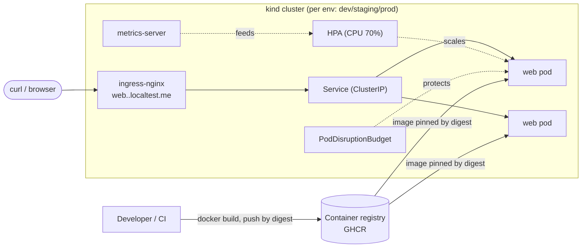

# Senior DevOps Assignment — Containerized Web App on Kubernetes

A production-oriented, reproducible deployment of a small containerized web app,
with Infrastructure as Code, a CI/CD pipeline, and a documented security,
observability, and scaling story.

The goal here is to show **engineering decisions and reasoning**, not a pile of
tools. Everything runs locally on `kind` so a reviewer can reproduce it end-to-end
with **no cloud account and no cost**, while the patterns (reusable IaC modules,
base/overlay config, digest-based promotion) are exactly the ones I'd use on a
managed cloud cluster.

---

## TL;DR — reproduce it

**Prereqs:** `docker`, `kind`, `kubectl`, `terraform` (≥ 1.5). *(macOS: `brew install kind kubectl terraform` + Docker Desktop.)*

```bash
make all ENV=dev      # provision kind cluster + addons, build image, deploy, smoke-test
# then:
curl -H "Host: web.dev.localtest.me" http://localhost/     # {"env":"dev","pod":"dev-web-...",...}
make down ENV=dev     # tear the cluster down
```

`make all` runs: `terraform apply` (cluster + ingress-nginx + metrics-server) →
`docker build` → `kind load` → `kubectl apply -k` → `rollout status` → `curl`.
Individual steps: `make up | build | load | deploy | smoke`.

---

## Repository layout

```
app/                     Flask app (/, /healthz, /readyz, /metrics, /work) + Dockerfile + tests
infra/
  modules/kind-cluster/  Reusable: a kind cluster wired for ingress   <-- reusable infra
  modules/addons/        Reusable: ingress-nginx + metrics-server (Helm)
  environments/          dev/ staging/ prod/ — thin wiring + tfvars     <-- env-specific config
deploy/
  base/                  Environment-agnostic k8s manifests (Kustomize base)
  overlays/{dev,staging,prod}/  Per-env name/scale/config/image
.github/workflows/       ci.yaml (build/test/scan/push) + cd.yaml (promotion)
docs/architecture.md     Production architecture (30 microservices) + diagram
docs/troubleshooting.md  The latency-incident playbook
Makefile                 One-command local workflows
```

## Architecture (this repo)



- **External exposure:** Ingress (`nginx`) → Service → pods, on
  `web.<env>.localtest.me` (the `localtest.me` wildcard resolves to `127.0.0.1`,
  so no `/etc/hosts` edits).
- **Health checks:** separate **liveness** (`/healthz`, cheap, dependency-free),
  **readiness** (`/readyz`, gates traffic), and **startup** probes. Readiness is
  runtime-togglable (`POST /toggle-ready`) to demo traffic-shifting.
- **Availability & scalability:** `minReplicas ≥ 2` (prod 3), HPA on CPU,
  PodDisruptionBudget, topology spread across nodes, and `maxUnavailable: 0`
  rolling updates.

For the **30-microservice production design** (mesh, managed Postgres/Redis/
RabbitMQ, GitOps, multi-team, 99.9 %), see **[docs/architecture.md](docs/architecture.md)**.

## Deployment process

**Local (this repo):** `make all ENV=<env>` — see TL;DR.

**CI/CD (`.github/workflows/`):**
1. **CI** on every push/PR: run unit tests → build all Kustomize overlays (catch
   config errors) → build image → **Trivy** scan → push to GHCR tagged with the
   **immutable git SHA** (+ moving `edge`).
2. **CD**: a successful CI on `main` auto-deploys to **dev**. A release tag `vX`
   promotes the **same image digest** to **staging**, then **prod** behind a
   required GitHub Environment approval.

> Note: the CD job steps that talk to a live cluster are illustrative `echo`s,
> since there's no hosted cluster in this exercise. The promotion *logic*
> (digest reuse, environments, approval gate) is real; wiring them to a cluster
> is `aws eks update-kubeconfig` / `az aks get-credentials` via OIDC + `kubectl apply -k`.

### Artifact promotion
One artifact, built once, identified by **immutable digest**. The exact image
validated in CI is what reaches prod — we never rebuild per environment, so
"passed in staging" means the identical bits ship. Overlays differ only in
config/scale, never in image contents.

### Rollback
- **Fast path:** `kubectl -n web-prod rollout undo deploy/prod-web` (Kubernetes
  keeps prior ReplicaSets) — seconds, no rebuild.
- **Deliberate path:** re-run CD pinned to the previous known-good SHA/digest
  (`workflow_dispatch` with `image_sha`), or in a GitOps model revert the Git
  commit and let the controller reconcile.
- `maxUnavailable: 0` + readiness gating mean a bad rollout never removes healthy
  capacity before new pods are actually serving.

## Security decisions

**No secrets in Git.** There are none in this repo (`ConfigMap` holds only
non-secret config). CI auth uses the short-lived, auto-injected `GITHUB_TOKEN`
and **OIDC** (`id-token: write`) — no long-lived cloud keys or kubeconfigs are
stored as secrets. In production, app secrets come from a cloud secrets manager
via the **External Secrets Operator**, and workloads authenticate with
**workload identity** (IRSA / GKE Workload Identity), never static credentials.

**Least privilege, applied here:**
- Dedicated `ServiceAccount` per workload, bound to **no** Roles, with
  `automountServiceAccountToken: false` (the app never calls the K8s API).
- Container: `runAsNonRoot`, `readOnlyRootFilesystem`, `allowPrivilegeEscalation:
  false`, **all capabilities dropped**, `seccompProfile: RuntimeDefault`.
- Non-root image (dedicated user in the Dockerfile), minimal `slim` base,
  multi-stage build to keep the attack surface small; Trivy scans in CI.

**Three (＋) security risks I considered:**
1. **Leaked credentials / secret sprawl.** *Mitigation:* nothing sensitive in Git
   or images; OIDC + short-lived tokens in CI; External Secrets + workload
   identity in prod; `.gitignore` excludes state/kubeconfigs.
2. **Compromised or vulnerable container image (supply chain).** *Mitigation:*
   pinned base image, multi-stage minimal image, non-root, Trivy scan in CI
   (gate on CRITICAL in prod), deploy by **immutable digest**; next step is image
   signing (cosign) + admission policy to only run signed images.
3. **Over-privileged workload / lateral movement.** *Mitigation:* least-privilege
   SA with no API token, dropped caps + read-only FS limit what a compromised pod
   can do; in prod, **default-deny NetworkPolicies** + mesh mTLS contain
   east-west movement, and namespace RBAC/quotas isolate teams.
4. *(bonus)* **Sensitive data exposure** — encryption in transit (mTLS) and at
   rest (KMS on datastores), least-privilege DB users per service.

## Observability & troubleshooting

- **Metrics:** app exposes Prometheus metrics at `/metrics` (request rate,
  latency histogram, errors — the RED method) with scrape annotations; cluster
  metrics via metrics-server (and Prometheus/Grafana in prod).
- **Health:** liveness/readiness/startup probes as above.
- **Alerting (prod):** SLO **burn-rate** alerts on latency/error budget, not just
  CPU — see below why that matters.

**Latency incident playbook** (all pods green, CPU 35 %, mem 55 %, no deploy, but
latency 200 ms → 5 s): full order-of-investigation, commands, hypotheses,
mitigation, and follow-up in **[docs/troubleshooting.md](docs/troubleshooting.md)**.
Short version: low CPU + healthy pods + a round-number 5 s ⇒ the app is **blocked
off-CPU on a downstream dependency** (most likely DB slowdown → connection-pool
exhaustion → queueing). A CPU-only HPA would never react to this — which is why
prod alerts/autoscaling should key off latency/queue depth too.

## Assumptions
- A reviewer has Docker + kind locally; cloud accounts aren't assumed (by design).
- "Any simple app" — I wrote a tiny Flask app so the CI build/test is *real*
  rather than pulling a stock image, and so probes/metrics are meaningful.
- Single region, multi-AZ is sufficient for the 99.9 % target; multi-region DR is
  out of scope.
- Terraform state is local here; a real setup uses a remote backend with locking,
  one state per environment (noted in `infra/environments/*/providers.tf`).

## Trade-offs
- **kind over a real cloud:** maximal reproducibility/zero cost for a reviewer, at
  the price of not exercising real cloud IAM/LB/managed data. The module boundary
  (`infra/modules/kind-cluster`) is where you'd swap in an EKS/AKS/GKE module
  without touching envs, app, or CI/CD.
- **Kustomize over Helm:** base/overlays make the "reusable vs env-specific" split
  very explicit with no templating language; Helm would be better for packaging/
  distributing many services (which is where I'd go at 30 services).
- **No CPU limit, memory limit set:** avoids CPU throttling latency; caps the
  non-compressible resource. Deliberate — explained inline in `deployment.yaml`.
- **CD deploy steps stubbed:** kept honest rather than pretending to hit a cluster
  that doesn't exist; the promotion/rollback logic is the reviewable part.

## What I'd improve with more time
- Wire CD to a real cluster (or a `kind`-in-CI job) and add post-deploy smoke +
  automated rollback on failed `rollout status`.
- Progressive delivery (Argo Rollouts / mesh canary) instead of plain rolling.
- Image signing (cosign) + admission control (Kyverno/Gatekeeper) to enforce
  signed, non-root, resource-bounded workloads.
- Ship the observability stack (kube-prometheus-stack + OTel + Grafana
  dashboards + SLO burn-rate alerts) as a Terraform-managed addon.
- Default-deny `NetworkPolicy` in the app namespaces + secret management via
  External Secrets, even locally (e.g. with a mock provider).
- Remote Terraform backend + `terraform plan` in CI on PRs (with policy checks).

## AI tool usage
I used an AI coding assistant (Claude) to scaffold the repo, draft manifests/IaC/
docs, and speed up boilerplate. I validated everything locally: `pytest` on the
app, `kustomize build` on all three overlays (cross-references, image, host, and
HPA patches confirmed), `terraform fmt` + `init` + `validate` on the IaC, and
`mermaid-cli` to confirm the diagrams render. I understand and stand behind every
file here; the architecture and troubleshooting reasoning are my own decisions.
