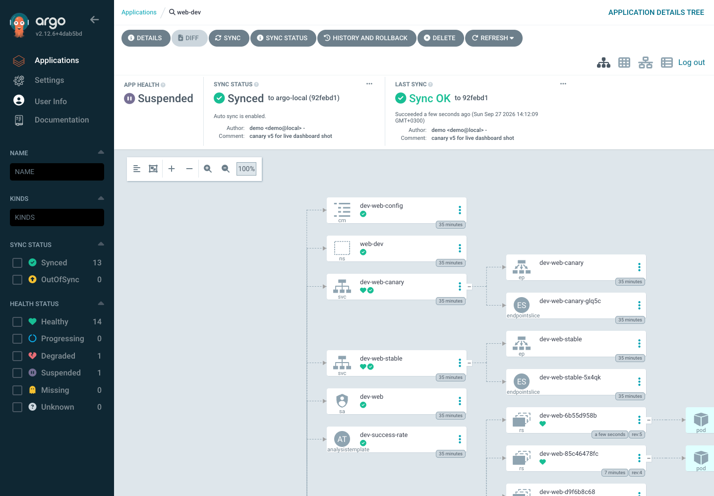
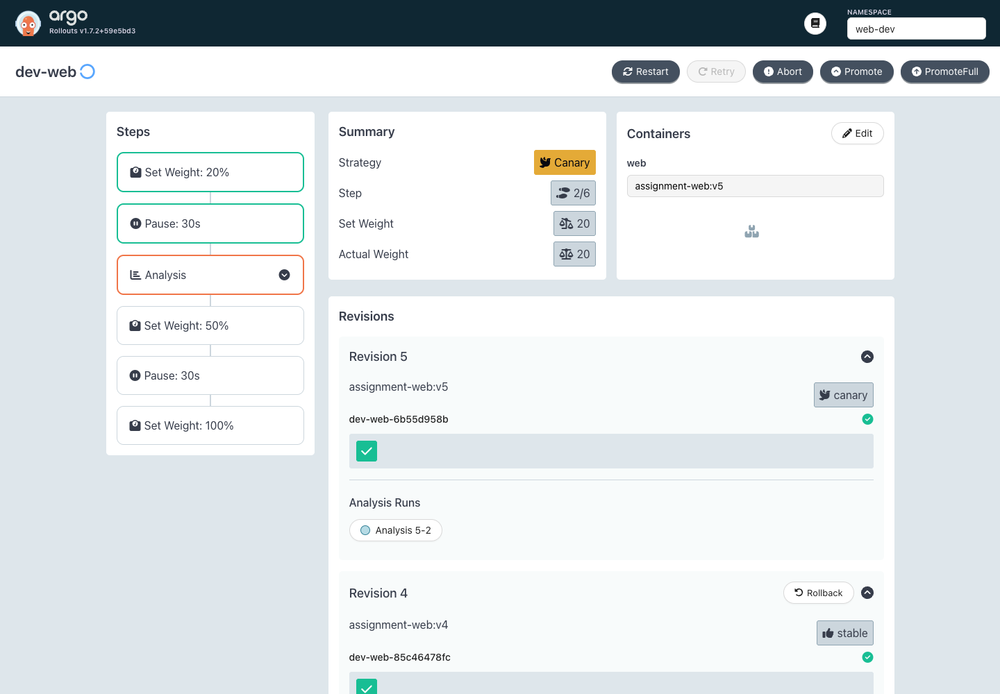

# Demo & Validation — run live on a real cluster

This is proof the solution actually runs, captured from a live `kind` cluster
(`terraform apply` → app deployed → Argo CD GitOps → Argo Rollouts canary). It is
evidence, not a substitute for running it — see the README for one-command repro.

> Environment note: run locally on kind (Docker Desktop). The app image isn't
> pushed to a registry, so it's built + `kind load`ed; for the Argo demo the repo
> is served by an in-cluster git server (the committed `argocd/` manifests point
> at the real GitHub URL — swapped to the git server only for the local run).

---

## 1. Infrastructure comes up from IaC

`terraform apply` provisions the cluster and the whole platform (Cilium, MetalLB,
ingress-nginx, Argo CD, Argo Rollouts, Prometheus, metrics-server):

```
Apply complete! Resources: 8 added, 0 changed, 1 destroyed.
Outputs:
cluster_name = "assignment-dev"
```

Nodes reach **Ready** — this proves the ordering is right (nodes stay NotReady
until Cilium, the CNI, is installed, since kind's default CNI is disabled):

```
$ kubectl get nodes
NAME                           STATUS   ROLES           VERSION
assignment-dev-control-plane   Ready    control-plane   v1.30.4
assignment-dev-worker          Ready    <none>          v1.30.4

$ kubectl -n kube-system get pods | grep cilium
cilium-9vx6k                       1/1  Running
cilium-operator-588786cc78-z8hg7   1/1  Running
```

## 2. Real LoadBalancer (MetalLB), not a NodePort hack

```
$ kubectl -n ingress-nginx get svc ingress-nginx-controller
NAME                       TYPE           EXTERNAL-IP      PORT(S)
ingress-nginx-controller   LoadBalancer   172.18.255.200   80:.../TCP,443:.../TCP
```

End-to-end request path `LoadBalancer IP → ingress → web-stable Service → pod`:

```
$ curl -H "Host: web.dev.localtest.me" http://172.18.255.200/
{"env":"dev","message":"Hello from the DevOps assignment app","pod":"dev-web-...","version":"0.0.0"}
```

## 3. NetworkPolicy is actually enforced (Cilium)

Default-deny with explicit allows. Same request, two source namespaces:

```
# from the ALLOWED namespace (monitoring) -> succeeds
$ kubectl -n monitoring run t --image=curlimages/curl -it --rm -- \
    curl -s http://dev-web-stable.web-dev.svc.cluster.local/
{"env":"dev","message":"Hello from the DevOps assignment app",...}

# from a NON-allowed namespace (default) -> blocked (connection fails)
$ kubectl -n default run t --image=curlimages/curl -it --rm -- \
    curl -s --max-time 5 http://dev-web-stable.web-dev.svc.cluster.local/
pod default/t terminated (Error)      # denied by default-deny
```

On kind's default CNI this test would *pass from both* (policies ignored). With
Cilium it's enforced.

## 4. GitOps — Argo CD reconciles the app from git

```
$ kubectl -n argocd get application web-dev -o jsonpath='sync={.status.sync.status} health={.status.health.status}'
sync=Synced health=Healthy
```

Argo CD owns the full app tree (Rollout, Services, HPA, Ingress, NetworkPolicies,
AnalysisTemplate), auto-syncing from git:



## 5. Progressive delivery — Argo Rollouts canary

Pushing a new image to git triggers a canary: **20% → analysis gate → 50% →
100%**, with automatic abort if the Prometheus success-rate gate fails.



Traffic really splits during the canary (20 requests through the LB while at 20%):

```
  17 assignment app       # stable
   3 assignment app v2    # canary  (~20%, matching setWeight: 20)
```

Both outcomes were exercised. The revision history shows the abort and the
success side by side:

```
├──# revision:5  dev-web-...   ReplicaSet   Healthy    canary
├──# revision:3  dev-web-...   ReplicaSet   Healthy    stable
│                dev-web-3-2   AnalysisRun  Successful          <- gate passed -> promoted
├──# revision:2  dev-web-...   ReplicaSet   ScaledDown
│                dev-web-2-2   AnalysisRun  Error               <- gate failed -> ROLLED BACK
```

- **Auto-abort:** first attempt failed the analysis gate → Rollouts aborted and
  kept 100% of traffic on the stable version (no bad release promoted).
- **Clean promotion:** after making the gate robust to metric warm-up, the canary
  progressed through all steps to 100%.

## 6. Bugs found by running it (that static checks missed)

Running it live is where the real value showed up — none of these are caught by
`kustomize build` / `terraform validate`:

| # | Bug | Fix |
|---|-----|-----|
| 1 | Kustomize doesn't rewrite name-refs *inside the Rollout CRD* (services, ingress, SA, configMap, HPA target, analysis template) | `deploy/base/kustomizeconfig.yaml` teaching kustomize those references |
| 2 | Overlay ingress patch still pointed at the pre-split `web` service | → `web-stable` |
| 3 | `runAsNonRoot: true` can't verify a **named** user | numeric `UID 10001` + `runAsUser` |
| 4 | gunicorn needs a writable `/tmp` under `readOnlyRootFilesystem` | `emptyDir` at `/tmp` |
| 5 | Canary analysis errored on empty metric during warm-up | `initialDelay` + `or on() vector(1)` fallback |

## Reproduce

```bash
make all ENV=dev            # cluster + addons + app + smoke test
# GitOps + canary: see README "Deployment process"
```
