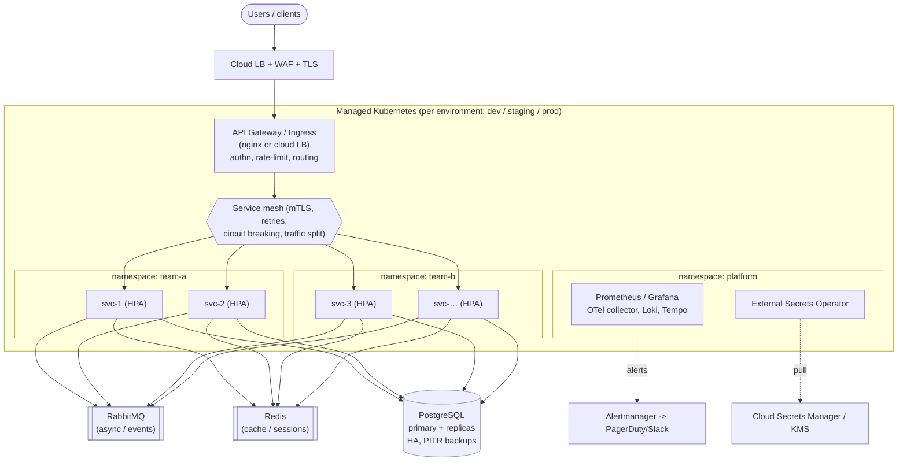

# Production Architecture (scaling to 30 microservices)

**Target:** ~30 microservices across Dev/Staging/Prod, backed by PostgreSQL,
Redis and RabbitMQ, ~500 req/s, **99.9 %** availability (≈ 43 min/month error
budget), multiple product teams, and **sensitive customer data**.

This is the "where this repo grows to" design. The repo itself is a small,
faithful slice of it (one service, Kustomize base/overlays, IaC modules,
digest-based promotion) that demonstrates the same patterns.

## Diagram

## Major decisions & why

**Managed Kubernetes, one cluster per environment.** Dev/Staging/Prod are
separate clusters (separate cloud accounts/subscriptions) for a hard blast-radius
and security boundary — a mistake in dev can never touch prod data. Managed
control plane (EKS/AKS/GKE) so we don't operate etcd. 30 services fit comfortably
in one cluster per env; namespaces (per team/domain) give the logical split.

**Namespace-per-team + RBAC + quotas.** Multiple teams share the platform without
stepping on each other: each team owns its namespace(s), RBAC scopes access,
`ResourceQuota`/`LimitRange` prevent one team starving others, and
`NetworkPolicy` default-denies cross-namespace traffic (see Security). Platform
team owns shared addons in a `platform` namespace.

**Service mesh (e.g. Istio/Linkerd).** At 30 services, cross-service concerns
should be uniform, not reimplemented per service: **mTLS everywhere**
(sensitive data in transit), retries with budgets, timeouts, circuit breaking,
and traffic splitting for canaries. It also gives golden L7 metrics for free.
*Trade-off:* operational complexity — worth it at 30 services, overkill at 3.

**Data stores are managed, not self-hosted.** PostgreSQL, Redis, RabbitMQ run as
managed services (RDS/Cloud SQL, ElastiCache/MemoryStore, Amazon MQ/CloudAMQP)
or via mature operators. Stateful, backup-critical systems are where managed
offerings earn their cost:
- **PostgreSQL:** primary + read replicas, Multi-AZ, automated backups + PITR,
  one logical DB per service (no shared schemas) to keep services decoupled.
- **Redis:** cache/session store, treated as a cache (app degrades, not dies, if
  it's cold). HA with replicas.
- **RabbitMQ:** async workflows and event-driven decoupling so a slow/broken
  service doesn't synchronously block callers; quorum queues for durability.

**Availability = 99.9 % through redundancy at every layer.** Multi-AZ nodes,
`minReplicas ≥ 2/3` + PDBs + anti-affinity/topology spread, rolling updates with
`maxUnavailable: 0`, and readiness gating so traffic only hits healthy pods.
99.9 % is achievable within one region + multi-AZ; going higher (99.99 %) would
justify multi-region and the DR complexity that comes with it — explicitly out of
scope for this target.

**GitOps delivery (Argo CD / Flux).** With 30 services × 3 envs, the cluster's
desired state must be declarative and auditable in Git. CI builds+signs an image;
CD promotes the **same digest** dev→staging→prod via PRs to an environments repo;
Argo reconciles. Progressive delivery (canary/blue-green) via the mesh +
Argo Rollouts. Rollback = revert the Git commit / pin previous digest.

**Observability as a first-class platform service.** Prometheus + Grafana
(metrics), OpenTelemetry + Tempo/Jaeger (traces — essential to debug latency
across 30 services, see the troubleshooting doc), Loki (logs). **SLOs with
burn-rate alerts** per service tied to the 99.9 % budget; alert on symptoms
(latency/error budget), not just causes (CPU).

**Security posture for sensitive data.** mTLS in the mesh, encryption at rest
(KMS) on all datastores, secrets via External Secrets Operator → cloud secrets
manager (never in Git/images), workload identity (IRSA/Workload Identity) instead
of static keys, default-deny NetworkPolicies, image signing + admission control,
and tight RBAC. See the README Security section for the threat model.

## What this maps to in the repo
| Production concept | Repo demonstration |
|---|---|
| Reusable infra vs env config | `infra/modules/*` vs `infra/environments/{dev,staging,prod}` |
| Per-env app config | Kustomize `base` + `overlays/{dev,staging,prod}` |
| Availability/scalability | HPA, PDB, topology spread, probes, `maxUnavailable: 0` |
| Digest-based promotion + rollback | `.github/workflows/{ci,cd}.yaml` |
| Least privilege | dedicated SA, dropped caps, read-only rootfs, no API token |
| Observability | `/metrics`, prometheus scrape annotations, RED metrics |
